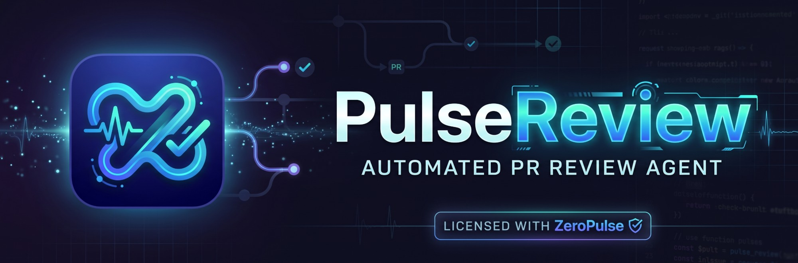

<p align="center">
  
</p>

<p align="center">
  <br>
  <b>Local AI pull-request reviews · free open-weight models · you approve everything that gets posted</b>
</p>

# ZeroPulse PR Review Agent (PulseReview)

**[⬇ Download for Windows (v0.1.1 beta)](https://github.com/steventa2024-lgtm/Pulse-Review/releases/download/v0.1.1beta/ZeroPulsePRReview.exe)** ·
[Releases](https://github.com/steventa2024-lgtm/Pulse-Review/releases) · Showcase website source: [`website/`](website/)

A local desktop companion for GitHub developers: sign in with GitHub, choose an open-weight model, pick a repository and pull request, and
get a grounded, verifiable code review plus one proposed test file — then decide yourself whether anything is published.

* **Inference:** OpenRouter *free* models (only text models OpenRouter currently prices at $0; code-focused ones listed first) or local **Ollama**
  (default `qwen3-coder:30b`). Paid models are never used.
* **Grounded findings:** every finding is checked against the real diff (file, line, quoted evidence). Unsupported claims are discarded and disclosed.
* **Human in the loop:** nothing is posted to GitHub without a typed confirmation (or the explicit CLI `--post`).
* **Safe by design:** repository content is treated as untrusted data; secrets are redacted before hosted inference; tests run only in an isolated Docker sandbox.

> **Status honesty.** See [Verification status](#verification-status) for exactly what has and has not been verified.
> In particular, the Windows `.exe` and native-window mode were **not built or run** in the environment this was developed in (Linux).

## Requirements

* Windows 10/11 (the source also runs on Linux/macOS in browser mode for development)
* Python 3.11+ (only to run from source or build the exe)
* Optional: [Ollama](https://ollama.com) for local models; Docker Desktop (Linux containers) for sandboxed test execution;
  Microsoft Edge WebView2 runtime for the native window (preinstalled on current Windows 11; otherwise the app falls back to your browser).

## Run from source

```powershell
py -3.11 -m venv .venv
.\.venv\Scripts\Activate.ps1
pip install -r requirements.txt
python main.py            # native window (falls back to the default browser if WebView2/pywebview is missing)
python main.py --browser  # force the browser
```

The UI server binds to `127.0.0.1` only, on a free port.

## First-time setup (in the app: **Settings**)

1. **GitHub — Sign in with GitHub (recommended).** ZeroPulse uses GitHub's *device sign-in* (the same flow as `gh auth login`):
   you get a short code, approve it on github.com, done — no token to copy. One-time setup, because GitHub requires every app to have its own ID:
   1. Open <https://github.com/settings/applications/new> → name `ZeroPulse PR Review`, Homepage and Callback URL `http://127.0.0.1`.
   2. Tick **Enable Device Flow** → **Register application** → copy the **Client ID** (`Ov23li…`, public — no client secret needed).
   3. Settings → GitHub → *Sign-in setup* → paste it → **Sign in with GitHub**.
   "Include private repositories" requests the `repo` scope; otherwise only `public_repo`. The token is stored with Windows DPAPI.
   A GitHub App Client ID also works (its tokens expire and are refreshed automatically). Personal access tokens remain available as a fallback.
2. **AI provider**
   * *OpenRouter (free):* paste an API key (free account) → **Refresh model catalog** → pick a model. Only zero-price models are listed and used.
   * *Local Ollama:* start Ollama, `ollama pull qwen3-coder:30b` (ZeroPulse never downloads models), set the context length, **Test local connection**.
   Switching providers needs no restart.
3. (Optional) Install and start **Docker Desktop** (Linux containers) to enable **Run in Sandbox**. Settings → Application → *Test sandbox*
   tells you exactly what is missing (not installed / engine not running / Windows-containers mode) and has a *Check again* button.
   ZeroPulse finds Docker Desktop even if `docker` is not on your PATH yet.

## Using the app

* **New review** → pick a **repository** and one of its **open pull requests** (or paste a link) → choose depth (Quick/Standard/Deep) and options → **START REVIEW**.
  Progress shows real pipeline stages (no fake percentages).
* **Review details** shows summary, overall risk, findings (with a line-numbered diff excerpt, evidence, suggested fix), the proposed test
  (copy / download / save / run in sandbox), the files actually inspected and every limitation. Uncertain items are labelled
  *verified / plausible / unverified*.
* **Publish**: choose overview or inline mode, untick findings you don't want, *Preview & post…*, edit the text, type
  `owner/repo#N` to confirm. ZeroPulse re-fetches the PR first; if the head commit changed since the review it refuses (stale) and asks for a refreshed review.
  Identical content cannot be posted twice. Reviews are posted as a plain `COMMENT` (never approve / request changes).
* **Code reviewer**: pick one of your repositories and a branch, browse its file tree, and audit the **whole repository, a folder or a
  single file**. Choose what to check (security vulnerabilities, leaked secrets & API keys, bugs & debugging, performance,
  maintainability). Every text file in scope is scanned for credentials deterministically; the most relevant source files are analysed
  by the model with real line numbers, and each finding is verified against the file. You get an overall health score (0–100, grade
  A–F), a per-area breakdown, findings with evidence and fixes, "Open line on GitHub", and a downloadable report. The code is read
  from a zip archive in memory and never executed.
* **Watched Repositories**: add repos, *Refresh* (uses conditional requests), see New/Updated PRs, *Review now*. Optional polling interval and
  auto-analysis are in Settings; auto-analysis never publishes.
* **Test Lab**: all generated tests; sandbox status; run/download.
* **Review History**: everything persists in SQLite; delete one review or clear all stored PR content.

### Private repositories

Private source code sent to OpenRouter leaves your machine. ZeroPulse asks for explicit consent per review (or a persistent opt-in in Settings).
Local Ollama never sends inference data to OpenRouter. Secret-looking values are redacted before hosted inference.

## Command line

```powershell
python review_agent.py                                   # help
python review_agent.py <PR_URL> --dry-run                # review locally, publish nothing (default)
python review_agent.py <PR_URL> --model qwen/qwen3-coder:free --provider openrouter
python review_agent.py <PR_URL> --generate-tests --output review.md
python review_agent.py <PR_URL> --json > review.json     # structured result on stdout, progress on stderr
python review_agent.py <PR_URL> --post [--post-mode inline]   # explicit publish (COMMENT review)
python review_agent.py <PR_URL> --allow-private-hosted   # consent for private repos + hosted model
```
Exit codes: `0` ok · `1` runtime failure · `2` invalid URL/usage · `3` consent required. For development a `.env` file
(`GITHUB_TOKEN`, `OPENROUTER_API_KEY`; see `.env.example`) is read; the CLI and the dashboard share the same pipeline and the same stored settings.

## Where data lives

`%APPDATA%\ZeroPulse\PRReviewAgent\` — `config.json` (settings + secret *references*), `reviews.db`, `logs\`, `secrets\` (DPAPI-encrypted blobs), `artifacts\`.
Override with `ZEROPULSE_DATA_DIR`. Nothing persistent is written to the PyInstaller extraction directory.

## Build the Windows executable

```powershell
powershell -ExecutionPolicy Bypass -File .\build_exe.ps1    # creates .venv, installs deps, runs tests, builds
# -> dist\ZeroPulsePRReview.exe
```
The script uses `nicegui-pack --onefile --windowed` (PyInstaller), bundles `dashboard/assets`, and reports each failure clearly.
Ollama models are never bundled. After building, launch the exe from another folder and confirm the window opens; if WebView2 is missing the app
shows a message and opens your browser (use **Quit** in the top bar to stop it in that mode).

## Tests

```powershell
python -m pytest -q          # unit/integration (mocked GitHub + LLM) and browser UI tests (skipped if Playwright/Chromium are absent)
```

## Sandbox safeguards (Docker)

Opt-in only. The PR archive is downloaded from GitHub and extracted with zip-slip/symlink/size protection into a disposable temp dir; the test runs in a container with:
`--network none` (network is enabled only for the optional, consented dependency-install step), `--cap-drop ALL`, `no-new-privileges`, read-only root FS,
non-root user, memory/CPU/PID limits, timeout with forced container removal, output cap, no Docker socket, no home/credential mounts, no ZeroPulse secrets in the environment.
Base images (`python:3.11-slim`, `node:20-slim`) are never pulled without consent. If Docker is unavailable: *"Sandbox unavailable — generated test has not been executed."*

## Known limitations

* Ollama's OpenAI-compatible endpoint may ignore the per-request context option (`num_ctx`); ZeroPulse still budgets prompts to your configured value.
* PR file listings are capped by GitHub (3000 files); missing files are reported as not reviewed.
* Test generation supports Python, TypeScript/JavaScript, Go, Rust and Java conventions; sandbox execution supports Python and JS/TS.
* Free OpenRouter models are rate-limited and can disappear; ZeroPulse reports this and lets you choose another verified free model.
* Watch polling checks page 1 of a repo's open PRs (sorted by last update) with an ETag, plus up to 3 pages when it changed.

## Verification status

Development environment: Linux container (no Windows, no PowerShell, no Docker daemon, no Ollama, OpenRouter blocked by the network policy).

| Area | Status |
|---|---|
| Automated test suite (mocked GitHub/LLM; real local HTTP server for PyGithub pagination; fake `docker` executable for sandbox flags) | **Passing** — run `pytest` |
| Dashboard rendered and driven in headless Chromium (review flow, typed-confirm publish, stale block, history/delete) | **Verified** (Linux, browser mode) |
| Real GitHub API: authentication, repo access/permissions, tree/file retrieval, open-PR listing with ETag/304, error mapping | **Verified live** (against this repo) |
| Real PR retrieval + real diff | **BLOCKED** — the only in-scope repo has no PR; no PR was created without being asked |
| Real OpenRouter catalog / free-model inference | **BLOCKED** — `openrouter.ai` unreachable (HTTP 403 from the sandbox proxy) |
| Real Ollama inference | **BLOCKED** — no Ollama installed |
| Real Docker sandbox execution | **BLOCKED** — Docker CLI present but no daemon; logic verified against a fake `docker` binary only |
| Live GitHub publishing | **BLOCKED** — no designated test PR, no explicit approval |
| PyInstaller one-file build | **Verified on Linux only** (binary launched from another directory; assets bundled; data dir outside the bundle; loopback-only) |
| `build_exe.ps1`, `dist\ZeroPulsePRReview.exe`, native window, WebView2, DPAPI storage | **NOT verified** — written but never executed (needs Windows) |
| Clean-Windows-machine launch | **NOT tested** |
